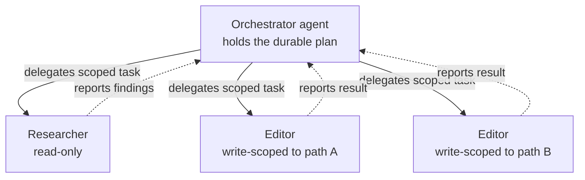
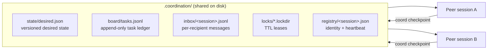
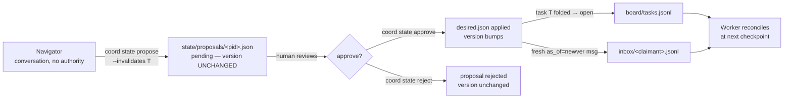

# Architecture

This document expands the design in [`SPEC.md`](../SPEC.md) §2–3. It explains the two
coordination modes, when to use each, the design principles the control plane enforces, and
how each classic multi-agent failure mode is mechanically prevented — and how a third
**navigator** role completes the role symmetry through human-approved desired-state proposals
(§7).

## 1. The problem

Running several GitHub Copilot agent sessions against **one repository** at the same time is
attractive — more work in parallel — but naively it breaks in predictable ways: sessions
wander off task, lose the plan, overwrite each other's branches, fail to coordinate, and act
on stale instructions. This repo is a drop-in layer that removes those failure modes.

The guiding idea: **invariants live in tooling, not in prose.** Instructions *teach* the
protocol; the `coord` CLI, the hooks, and git *enforce* it. A model under context pressure can
skip a paragraph; it cannot skip a `preToolUse` hook that denies an out-of-scope write.

## 2. Two coordination modes

### Native mode (preferred): hub-and-spoke

One **orchestrator** agent decomposes the work and delegates scoped slices to **worker**
sub-agents. Each worker runs in an isolated context and reports back through Copilot's native
sub-agent lifecycle. Coordination is **vertical** (parent ↔ child), so there is no lateral
peer-messaging problem to solve at all — the parent holds the plan and the exit criteria, and
children start fresh with only their slice.



Prefer this mode. It is simpler and has fewer moving parts because the runtime already gives
you preemption (the parent controls the children) and delivery guarantees (lifecycle events).

### Fallback mode: filesystem control plane

Some work is genuinely done by **long-running peer sessions** that are *not* in one
parent/child tree — e.g. two separate Copilot windows a human opened, each a top-level agent.
Peers have **no preemption** (you cannot interrupt another top-level session) and **no
delivery guarantees** (there is no message bus). For that case, sessions coordinate through a
shared on-disk **control plane** under `.coordination/`, driven by the `coord` CLI, which they
read at defined **checkpoints**.



This is the mode the locked [`coord.py`](../coord/coord.py) implements. It is a *fallback*
because it re-creates, on the filesystem, the preemption and delivery properties that
hub-and-spoke gets for free.

### Choosing a mode

| Situation | Mode |
|---|---|
| One driver decomposing work into scoped slices | **Native** hub-and-spoke (orchestrator + workers) |
| Sub-agents that live and die inside one parent run | **Native** |
| Two+ independent, long-lived sessions a human started separately | **Fallback** control plane |
| Peers that must survive across many turns and re-sync periodically | **Fallback** |

When in doubt, start native. Reach for the control plane only when you have true peers.

## 3. Design principles (do not violate)

These come from `SPEC.md` §2 and are baked into `coord.py`:

1. **Declarative state over imperative messages.** The primary channel is a versioned
   `desired.json` that sessions *reconcile toward* at checkpoints — not commands dropped in a
   queue. "Current target is X" read fresh never goes stale the way a queued "do X" does.
2. **Deterministic core, probabilistic shell.** Coordination invariants live in the CLI,
   hooks, and git — never in prose the model can skip. Instructions teach; tools enforce.
3. **Append-only ledgers.** The task board and inboxes are JSONL **appends**, never
   read-modify-write on a shared file, so concurrent writers can't clobber each other. Mutable
   state (`desired.json`, cursors, lock metadata) is written atomically via temp file +
   `os.replace`.
4. **Leases, not locks.** Every lock has a TTL and is steal-able **only** when the lease has
   expired **and** the holder's heartbeat is provably stale. A crashed session cannot deadlock
   the fleet.
5. **Small units + frequent checkpoints.** Because sessions can't be preempted, work is broken
   into small units with a `coord checkpoint` beat between each, which is where a session
   picks up stop-flags, fresh messages, and desired-state changes.

## 4. The five failure modes → the mechanism that fixes each

| Failure mode | Fix (in this repo) |
|---|---|
| Agents don't stop / wander off task | Scoped tools per agent (read-only workers can't edit) + `preToolUse` write-scope hook + orchestrator holds exit criteria; `stop`/`STOP` flags halt a session at its next checkpoint (exit 3). |
| Lose context | Orchestrator holds the durable plan; workers start fresh with only their slice; per-agent skills preloaded at startup. |
| Overwrite each other's branches | Worktree-per-worker (native) + write-scoped tools + `preToolUse` hook rejecting writes outside a session's `owned_paths`. |
| Don't coordinate | Hub-and-spoke via the orchestrator + native lifecycle events; no lateral messaging to get wrong. |
| Append-only queue / stale messages | Native `steering` for live redirect; fallback: per-recipient inboxes with `as_of` + TTL **staleness filtering**, surfaced only at checkpoints. |

## 5. Control-plane layout

`coord init` creates this tree under `COORD_ROOT` (default `.coordination/`):

```
.coordination/
  registry/<session>.json          # identity: role, branch, worktree, owned_paths, heartbeat
  inbox/<session>.jsonl            # append-only per-recipient messages
  cursor/<session>.json            # how far this session has consumed its inbox
  locks/<name>.lockdir/meta.json   # a lease: holder, acquired, ttl (dir = atomic mkdir)
  state/desired.json               # versioned declarative desired state
  board/tasks.jsonl                # append-only task ledger (event-sourced)
  board/events.jsonl               # append-only audit log of coordination events
  control/STOP, control/STOP-<session>   # halt flags
  log/                             # reserved
```

Key encodings:

- **Lock names with `/` are flattened to `__`** (`shared/theme.json` → `shared__theme.json`)
  so every lockdir lives directly under `locks/` and stays visible to `status`/`reap`. This
  also blocks path traversal in a resource name.
- **Tasks are event-sourced.** `board/tasks.jsonl` is a log of task events; the current state
  of a task is the fold of its events. Claims and completions are appends, never rewrites.
- **Mutable files are atomic.** `desired.json`, cursors, registry entries, and lock metadata
  are written to a temp file and `os.replace`d into place (atomic on POSIX and Windows).

See [`protocol.md`](./protocol.md) for the full command surface and the exact on-disk shapes,
and the JSON Schemas under [`../coord/schema/`](../coord/schema/) for the validated record
formats.

## 6. Failure semantics

- **A dead session** (no heartbeat for `HEARTBEAT_STALE_SEC` = 300s) is treated as gone. Its
  leases become steal-able once their TTL also expires, and `coord reap` requeues its claimed
  tasks so the fleet doesn't wedge.
- **A broken hook fails open.** If the `preToolUse` guard can't parse its payload or resolve
  the acting session, it *allows* the tool and logs to stderr — a bug in the guard must never
  block every tool call. It fails **closed** only on a genuine, well-formed scope violation.
- **A stale message is dropped, not delivered.** `checkpoint` and `inbox` skip messages whose
  TTL has expired or whose `as_of` is older than the current desired-state version, and report
  only a count of what was skipped.

## 7. Three roles, one seam: `desired.json`

§2 described two coordination *modes*. Those modes are populated by **roles**, and the control
plane is designed around a symmetry of three:

| Role | Has | Lacks | Its lever on the fleet |
|---|---|---|---|
| **Orchestrator** | authority | conversation | dispatches, reaps, integrates — and must keep ticking |
| **Navigator** | conversation | authority | can only *propose* a `desired.json` change a human approves |
| **Worker** | execution within owned paths | both of the above | claims a task, works its slice, reconciles at checkpoints |

The orchestrator is **authority without conversation**: it holds the plan, dispatches work,
reaps dead sessions, and integrates finished branches — but it cannot afford to sit and
deliberate, because if it stalls the fleet stalls. The navigator is the mirror image,
**conversation without authority**: it deliberates with the human about *what the fleet should
be doing*, but it cannot dispatch, claim, complete, merge, edit, or approve anything. The
worker executes, but only within its owned paths.

The **seam** between the orchestrator and the navigator is the one artifact workers already
reconcile against: the versioned `desired.json`. The navigator never touches the fleet
directly — it can only write a *proposal* to amend `desired.json`, which a human approves. On
approval the change is applied, the version bumps, and workers pick it up at their next
checkpoint along the exact propagation path §3 principle #1 already defines. This is why adding
a navigator required **no new channel**: it plugs into the declarative-state seam that was
there all along.

### propose → approve → propagate



Three properties make this a genuine lever, not a back door:

1. **Propose does not act.** `coord state propose` only writes a pending record under
   `state/proposals/`; it does **not** bump the live version, so nothing propagates until a
   human approves. The navigator's shell is additionally constrained by the write-scope hook to
   a propose/read allow-list (see [`protocol.md`](./protocol.md) and
   [`hooks/README.md`](../hooks/README.md)), so it cannot approve its own proposal.
2. **Approval is the only thing that moves the world.** `coord state approve` applies the
   value, bumps the version, and marks the proposal `applied` — the same monotonic-version
   write `state set` uses. A human (or the orchestrator on a human's behalf) runs it; the
   navigator role is denied it by the hook.
3. **Invalidation is a re-plan, not a stomp** — see below.

### Invalidation is a re-plan event, not a stomp

When an approved design change makes in-flight work obsolete, approving with
`--invalidates T` turns the change into a **controlled re-plan** rather than a silent overwrite
of a worker mid-task:

- Task `T` is **folded back to `open`** on the board (an append to the ledger, not a rewrite),
  so it is re-claimable — by the same worker starting clean, or by another.
- A **fresh message** (`as_of` = the *new* version) is dropped into the prior claimant's inbox
  telling it to stop and re-claim. Because `as_of` is the new version, the note lands **fresh**
  at the claimant's next checkpoint instead of being filtered out as stale.
- If the prior claimant kept working and tries to `coord complete T`, the **stale-completion
  guard** refuses it (non-zero exit): the task is no longer `claimed` by that session, so stale
  work cannot be marked done. The worker must re-claim `T` first.

The invariant this preserves: **the navigator can influence the fleet only by proposing a
`desired.json` change a human approves.** It never dispatches, merges, edits, or self-approves.
Every path by which its intent reaches a worker runs through the human-gated version bump and
the checkpoint the worker already performs. See [`quickstart.md`](./quickstart.md) Walkthrough
C for a runnable end-to-end trace.

## 8. The autonomy loop: `tick`, `run`, and the honest runtime seam

§2–7 describe how sessions coordinate; this section describes how the fleet **reconciles
itself** without a human driving every step, and where that automation honestly stops.

### `tick`: one pure reconciliation pass

`coord tick` is the keystone: a single, deterministic pass that reaps dead sessions, runs coded
acceptance gates (`--verify`), requeues or escalates on repeated failure, advises dispatch of
ready work to idle workers, nudges a claimant whose heartbeat is aging, enforces budgets, and
surfaces open escalations — then returns. It is built from the **same primitives** the rest of
the CLI already uses (`_reap_once`, the verify/escalate helpers), so there is exactly one
reap/verify/escalate implementation, not a duplicate "autonomous" copy.

```mermaid
flowchart TD
    T[coord tick — one pass] --> R[1. reap dead sessions<br/>release stale leases, requeue claimed tasks]
    T --> V[2. verify acceptance<br/>run --verify on done, unverified tasks]
    V -->|pass| VOK[stays done, verified:true]
    V -->|fail, attempts < max| REQ[requeue to open<br/>notify prior claimant]
    V -->|fail, attempts >= max| FAIL[mark failed<br/>open a blocker escalation]
    T --> D[3. dispatch (advisory)<br/>message an idle worker to claim ready work]
    T --> N[4. stall nudge (advisory)<br/>message an aging-but-alive claimant]
    T --> B[5. budgets<br/>failed+escalate past max_attempts/deadline;<br/>coord stop past max_parallel/time_budget]
    T --> S[6. surface<br/>open escalations -> awaiting_decision]
```

**HARD INVARIANT**: `tick` never writes `authorized_phase`, never approves/rejects a proposal,
and never performs a git operation. It reconciles strictly *within* the human's current
authorization — it is a fast, safe, re-runnable pass, not a planning or governance act.

### `run`: the thin, bounded loop

`coord run [--interval SEC] [--max-ticks N] [--once]` is the only non-pure autonomy command, and
it is deliberately thin: it calls the exact same tick pass in a loop, sleeping `--interval`
seconds between passes, and stops after `--max-ticks` passes (`--once` = 1) or as soon as a
fleet-wide `STOP` is set. **All reconciliation logic lives in `tick`** — `run` contributes
nothing but sleeping, looping, and counting, so its behavior is exactly `tick`'s behavior,
replayed.

### The honest runtime seam: dispatch is advisory, not delivery

`tick`'s dispatch and stall-nudge steps are **advisory**: they *record* a directive — "worker X,
claim task Y" — as a message in X's inbox. That is all `coord` can do from the filesystem. It
cannot reach into a fully-idle OS-level session and make it look at that message; **waking** a
dormant session (or restarting a crashed process) is a runtime adapter's job, sitting outside
`coord` entirely. This is intentional, not a gap: a stdlib-only, offline filesystem control
plane has no channel to a process that isn't already polling it.

The other half of the seam is the worker's own **self-continue** loop: every `coord checkpoint`
now reports a `continue` boolean — true while the calling session still holds an unfinished
(`claimed`, not `done`) task. A worker that is still running checks this at each checkpoint and
keeps going without waiting to be re-prompted; it only yields the turn when its task reaches
`done`, `stop` is set, or it must escalate. Together, `tick`'s advisory dispatch/nudge messages
and the worker's `continue`-driven self-loop cover the reconciliation logic completely — the one
piece genuinely left to the runtime is *waking a session that has gone fully idle*, which no
in-process, offline tool can do. See [`quickstart.md`](./quickstart.md) Walkthrough D for a
runnable trace of a failing acceptance gate driving `run` all the way to an open escalation.

## 9. The cockpit seam: whole-fleet plans, human-gated

§7 described a navigator proposing a single `desired.json` key. COCKPIT_SPEC extends the same
propose → approve → propagate shape to a **whole fleet plan** — a declared set of workers with
non-overlapping owned paths (`fleet`) plus the task DAG they'll run — and adds a single read-only
view (`coord cockpit`) so a human (or a navigator drafting for one) can see the whole plane at a
glance instead of stitching together `tasks`/`status`/`escalations`/`plans`.

### Plans: propose → approve → spawn

```mermaid
flowchart LR
    NAV[Navigator or human<br/>drafts a plan.json] -->|coord plan propose --file plan.json| PP[state/plans.jsonl<br/>pending — version UNCHANGED]
    PP -->|coord plans / coord plan show| REVIEW[human reviews<br/>current -> proposed diff]
    REVIEW -->|approve?| H{human decision}
    H -->|coord plan approve --id pid<br/>ORCHESTRATOR ONLY| APPROVE[atomic: tasks created<br/>desired.fleet set<br/>version += 1<br/>plan -> approved]
    H -->|coord plan reject --id pid<br/>ORCHESTRATOR ONLY| REJECT[plan -> rejected<br/>nothing else changes]
    APPROVE -->|capped at max_concurrent| SPAWN[state/directives.jsonl<br/>initial spawn directives]
    SPAWN -->|coord tick, every pass| TICK[spawn step: top up missing<br/>workers up to max_concurrent;<br/>over-cap -> one decision escalation]
    TICK -->|Phase 7 runtime adapter| ADAPTER[consumes spawn directives,<br/>actually starts the worker session]
```



A plan is validated **twice**: once at `propose` (worker ids unique, `owned_paths` non-empty and
pairwise non-overlapping — the same `_owned_paths_overlap` rule `write_scope_guard.py` already
enforces on real writes — every task's `owned_by`/`deps` resolve, every task carries a `verify`
key, and no task id collides with the live board), and again at `approve` (a task id may have
landed on the board between propose and approve). If re-validation fails, `approve` makes **zero**
changes — no partial tasks, no fleet mutation, no version bump — matching the same all-or-nothing
shape as `state approve`'s transaction.

`plan approve` is the **only** new command that bumps `desired.version` in this addendum, and it
never touches `authorized_phase` — the phase gate stays exclusively under the human/orchestrator
control already described in `BUILD_PLAN.md`. `plan approve`/`plan reject` are **orchestrator-only
**: the write-scope hook denies both for every other role, including the navigator that may have
proposed the plan in the first place (§7's same "propose ≠ approve" separation, now at fleet
scope).

### Spawn directives are advisory, same honest seam as dispatch (§8)

`plan approve`'s initial batch and `tick`'s ongoing spawn step both only **append a directive** —
`{"kind":"spawn","worker":"<id>","owned_paths":[...],"as_of":<version>,"ts":"<iso>"}` — to
`state/directives.jsonl`, capped at `fleet.max_concurrent`. Neither `coord` command can reach out
and actually start a session; that is the Phase 7 **runtime adapter**'s job, exactly as §8
describes for dispatch. `tick`'s spawn step is idempotent (a worker with any spawn directive ever
emitted counts as in-flight, so it is never re-spawned) and, when genuine demand exceeds the cap,
opens **exactly one** deduplicated `decision` escalation rather than spamming one per over-cap
tick or per over-cap worker.

### `coord cockpit`: one read, the whole plane

`coord cockpit [--json]` is a **pure read** — no writes, no heartbeat, no lock/git side effects —
that aggregates: `desired` (version, `authorized_phase`, fleet), `tasks` (counts + ids grouped by
status), `workers` (each declared fleet worker's liveness, heartbeat age, and held task),
`decisions` vs. `blockers` (open escalations, kept as two distinct keys so a human can triage
governance questions separately from stuck work), `pending` (plan and proposal ids awaiting a
decision), and `capacity` (live workers vs. `max_concurrent`, plus any spawn directives not yet
consumed). It exists so a navigator (or a human) can answer "what does the fleet need from me"
without manually cross-referencing `tasks`, `status`, `escalations`, and `plans` — see
[`quickstart.md`](./quickstart.md) Walkthrough E for a runnable propose → approve → spawn trace.
